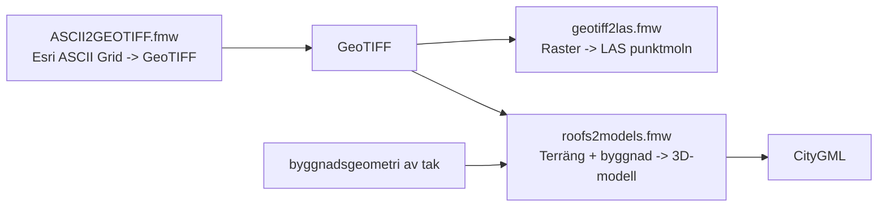

# FME-skript i mappen 3D-modeller

## Översikt per script för terräng

### ASCII2GEOTIFF.fmw
Konverterar terrängdata från Esri ASCII Grid till GeoTIFF.

Flöde:
- Inläsning av ASCII Grid-terräng.
- Konvertering till GeoTIFF.

### geotiff2las.fmw
Konverterar GeoTIFF till LAS, alltså raster till punktmoln.

Flöde:
- Läser GeoTIFF från terrängkedjan.
- Reprojektering till `EPSG:4326`.
- Gör om rasterceller till punkter.
- Kombinerar till LAS.
- Används när terrängen ska vidare till punktmolnsformat.

## Översikt per script för terräng för 3D-byggnader

### roofs2models.fmw
Bygger 3D-byggnadsmodeller från terrängrastret och byggnadstaklager.

Flöde:
- Läser terrängraster och byggnadstak.
- Extraherar takkonturer och vertexer.
- Hämtar höjder från raster för varje vertex.
- Skapar volymer mellan terräng och tak.
- Klipper volymerna och skriver byggnadsmodeller i CityGML.

## Hur skripten hör ihop

1. `ASCII2GEOTIFF.fmw` gör om rå terrängdata till GeoTIFF.
2. `geotiff2las.fmw` använder GeoTIFF  och gör om den till LAS (punktmoln).
3. `roofs2models.fmw` använder samma typ av GeoTIFF som terrängunderlag, men kombinerar den med byggnadsdata för att skapa 3D-byggnader.

## Flödesbild

