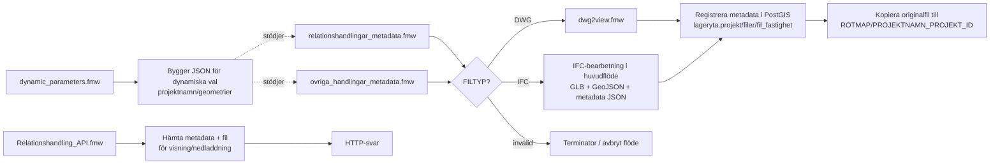

# FME-skript Handlingar metadata

## Översikt per script

### relationshandlingar_metadata.fmw
Huvudflöde för uppladdning och registrering av relationshandlingar.

Flöde:
- läsa filer och expandera till en feature per fil
- klassa filtyp och stoppa invalid
- DWG-väg via dwg2view.fmw
- IFC-väg via Python/IfcConvert/gltfpack
- registrera metadata i PostGIS och kopiera originalfil

### ovriga_handlingar_metadata.fmw
Mycket likt huvudflödet ovan, men för "övriga handlingar" och med extra dokumentparametrar (t.ex. handlingstyp/skede/sökbar_synlig).

Flöde:
- läsa filer och expandera till en feature per fil
- klassa filtyp och stoppa invalid
- DWG-väg via dwg2view.fmw
- IFC-väg via Python/IfcConvert/gltfpack
- registrera metadata i PostGIS och kopiera originalfil


### dwg2view.fmw
Specialiserat underflöde för DWG-konvertering till visningsformat.

Flöde:
- Kontrollerar om DWG:filen innhåller 3D-data
- Om DWG:n inte innhåller 3D-data sparas filen som DXF för att kunna visualiseras i kartan
- Om filen innehåller 3D-data så skapas en glb-fil med hjälp av ett python-script

### Relationshandling_API.fmw
API-workspace (Data Virtualization) för hämtning av metadata och filer för visning och nedladdning.

Flöde:
- Tar emot query-parametrar
- Slår upp metadata i databas
- Bygger svar och väljer fil beroende på anropstyp
- Skapar paramterar vid visualiseringsanrop
- Returnerar HTTP-svar

### dynamic_parameters.fmw
Hjälpworkspace som bygger dynamiska parameterlistor i JSON.

Flöde:
- Hämtar valbara data (projektnamn/geometrier) via SQL
- Sätter ihop till en JSON-struktur
- Skriver JSON som kan användas för dynamiska GUI-val

## Hur skripten hör ihop

1. Uppladdning/registrering startar i relationshandlingar_metadata.fmw eller ovriga_handlingar_metadata.fmw.
2. Filen klassas till DWG/IFC/invalid.
3. Vid DWG skickas jobb till dwg2view.fmw för visningsfiler (DXF/GLB beroende på innehåll).
4. Vid IFC gör huvudflödet egen IFC-bearbetning (GLB + GeoJSON + metadata JSON).
5. Metadata och relationer skrivs till PostGIS, och originalfil kopieras till projektsökväg.
6. Relationshandling_API.fmw läser databas och filinfo för att servera fetch-anrop (visning/nedladdning).
7. dynamic_parameters.fmw bygger dynamiska val till formulärkomponenter.

## Flödesbild



## Krav

### För att Relationshandling_API.fmw och visualisering av 3D-data ska fungera krävs följande
Konfiguration för FME Flow och IIS:
- Workspace:t behöver publiceras som en FME Flow Data Virtualization API-tjänst.
- För visualisering i klienten behöver API-svaret skicka följande headers:
	- `x-epsg`
	- `x-position`
	- `x-translation`
	- `x-rotheading`
- I FME Flow ställs detta in under Network Settings i fältet `Access-Control-Expose-Headers`, där följande värde behöver anges:
	- `x-epsg, x-position, x-translation, x-rotheading`
- Om lösningen ligger bakom IIS behöver även IIS exponera samma headers. Lägg till följande i site:ens `web.config`:

```xml
<system.webServer>
	<httpProtocol>
		<customHeaders>
			<add name="Access-Control-Expose-Headers"
					 value="x-epsg, x-position, x-translation, x-rotheading" />
		</customHeaders>
	</httpProtocol>
</system.webServer>
```

### För att dynamic_parameters.fmw, relationshandlingar_metadata.fmw och ovriga_handlingar_metadata.fmw ska fungera och skapa GLB-filer krävs följande
Krav för GLB-konvertering:
- Dessa Python-paket (ifcopenshell, pyproj, trimesh, pygltflib, concave-hull, scikit-learn, scipy) behöver installeras både i lokal FME och i FME Flow-engine där jobbet körs.
-  Installeras med:
	python -m pip install ifcopenshell pyproj trimesh pygltflib concave-hull scikit-learn scipy --target "X:\Safe Software\Fme{Flow}\resources\engine\Plugins\Python\python313"
- FME Workbench kan behöva köras som administratör om Python-anropet inte hittar paketen.
