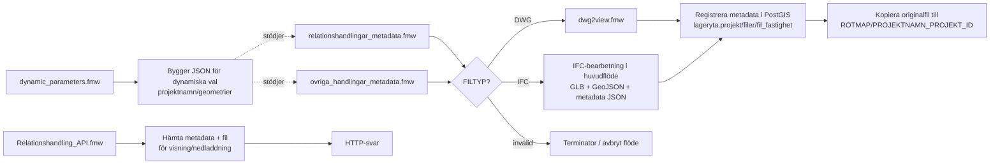

# FME-skript Handlingar metadata

## Översikt per script

### relationshandlingar_metadata.fmw
Huvudflöde för uppladdning och registrering av relationshandlingar.

Flöde:
- "Läser $(SOURCE_FILE), tolkar ev. flera filer, bygger listan source_files{}.path och exploderar till en feature per fil."
- "Tar fram FILTYP (dwg/ifc/invalid), filstorlek och projektnamn/id. Bygger SAVE_PATH/PROJECT_MAP. Tester_4 stoppar invalid."
- "Om FILTYP=ifc: kör IFC->GLB + planpolygon GeoJSON + metadata JSON via Python (IfcOpenShell/IfcConvert + ev. gltfpack)."
- "Om det är en annan filtyp än DWG eller IFC avbryts flödet."
- "Skickar DWG-jobb till FME Flow (dwg2view.fmw) med parametrar; väntar på resultat."
- "Registrerar fil och metadata i PostGIS (lageryta.projekt + lageryta.filer + lageryta.fil_fastighet). Geometri tas från _geometry."
- "Kopierar originalfilen till filservern."

### ovriga_handlingar_metadata.fmw
Mycket likt huvudflödet ovan, men för "övriga handlingar" och med extra dokumentparametrar (t.ex. handlingstyp/skede/sökbar_synlig).

Flöde:
- läsa filer och expandera till en feature per fil
- klassa filtyp och stoppa invalid
- DWG-väg via dwg2view.fmw
- IFC-väg via Python/IfcConvert/gltfpack
- registrera metadata i PostGIS och kopiera originalfil

### dwg2view.fmw
Specialiserat underflöde för DWG-konvertering till visningsformat.

Flöde:
- "Kontrollerar om DWG:filen innhåller 3D-data"
- "Om DWG:n inte innhåller 3D-data sparas filen som DXF för att kunna visualiseras i kartan"
- "Om filen innehåller 3D-data så skapas en glb-fil med hjälp av ett python-script"

Tolkning:
- DWG analyseras
- 2D-data går till DXF för karta
- 3D-data går till GLB för 3D-visning

### Relationshandling_API.fmw
API-workspace (Data Virtualization) för hämtning av metadata och filer för visning och nedladdning.

Flöde:
- Tar emot query-parametrar
- Slår upp metadata i databas
- Bygger svar och väljer fil beroende på anropstyp
- Skapar paramterar vid visualiseringsanrop
- Returnerar HTTP-svar

### dynamic_parameters.fmw
Hjälpworkspace som bygger dynamiska parameterlistor i JSON.

Flöde:
- Hämtar valbara data (projektnamn/geometrier) via SQL
- Sätter ihop till en JSON-struktur
- Skriver JSON som kan användas för dynamiska GUI-val

## Hur skripten hör ihop

1. Uppladdning/registrering startar i relationshandlingar_metadata.fmw eller ovriga_handlingar_metadata.fmw.
2. Filen klassas till DWG/IFC/invalid.
3. Vid DWG skickas jobb till dwg2view.fmw för visningsfiler (DXF/GLB beroende på innehåll).
4. Vid IFC gör huvudflödet egen IFC-bearbetning (GLB + GeoJSON + metadata JSON).
5. Metadata och relationer skrivs till PostGIS, och originalfil kopieras till projektsökväg.
6. Relationshandling_API.fmw läser databas och filinfo för att servera fetch-anrop (visning/nedladdning).
7. dynamic_parameters.fmw bygger dynamiska val till formulärkomponenter.

## Flödesbild

