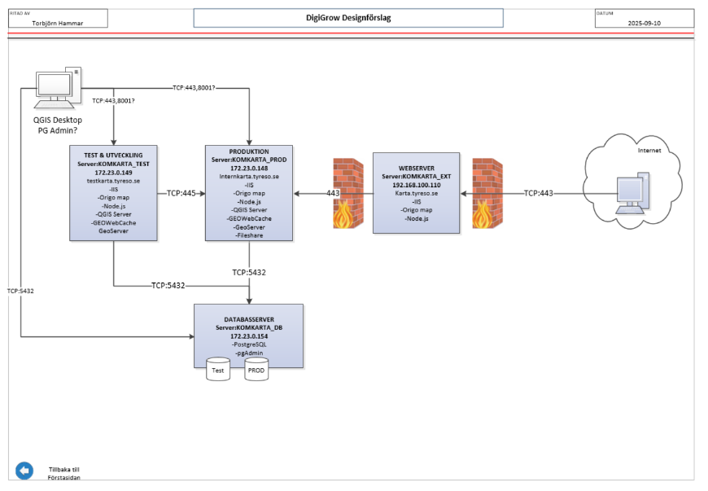

# Projektöversikt – Digigrow Fas 2

### **Disclaimer**
DigiGrow Fas 2 genomfördes som ett tidsbegränsat innovationsprojekt med begränsade resurser. Även om alla plugins fungerar är koden inte fullständigt optimerad och kan effektiviseras eller förenklas. Ändringar i projektet kan därför komma att ske successivt.

### **Inledning**
Detta repository innehåller konfigurationer, installationer och byggfiler för den Origo-baserade kartklienten samt tillhörande serverkomponenter:

* **GeoServer** (Tomcat + IIS reverse proxy)
* **QGIS Server** (IIS FastCGI)
* **Origo-klient** (statisk build + plugins)
* **Origo Admin**
* **Miljöspecifika konfigurationer**

Syftet med repot är att samla allt som krävs för att reproducera en miljö samt säkerställa att installationer och deployments kan versioneras och följas över tid.

# Versionsinformation

| Komponent       | Version  |
| --------------- | -------- |
| **Origo**       | 2.9.0 |
| **GeoServer**   | 2.28.0   |
| **QGIS Server** | 3.44.3-Solothurn |
| **QGIS Desktop** | 3.40.11 |
| **Tomcat**      | 9.0.111 |
| **PostgreSQL**  | 18 |

# Mappstruktur

| Katalog      | Innehåll                                                        |
| ------------ | --------------------------------------------------------------- |
| `/Dokument/` |                |
| `/FME/`    | FME-script för handlingar, metadata, och 3D-modeller                           |
| `/Origo/`    | Statisk build av Origo (t.ex. v2.9.0)                           |
| `/Origo_Admin/`    | Dokumentation Origo Admin, Installationsguide                          |
| `/Plugins/`  | Origo-plugins                                                   |
| `/Server/`   | Servermiljö: GeoServer, QGIS Server, IIS, Origo-build, Postgres |
| `/Postgres/` | Installationer och scripts för PostgreSQL/PostGIS, dokumentation RelationshandlingarDB              |

# Installationer (Servermiljö)

Här finns länkar till installationsguider för Servermiljö.

### **Origo Admin**

[Öppna installationsguide](./Origo_Admin/00-översikt.md)

### **PostgreSQL / PostGIS**

[Öppna installationsguide](./Postgres/README.md)

### **GeoServer (Tomcat + IIS-proxy)**

[Öppna GeoServer-guide](./Server/Geoserver/README.md)

### **QGIS Server (FastCGI via IIS)**

[Öppna QGIS-serverguide](./Server/QGIS_Server/README.md)

# Arkitektur

Övergripande systemarkitektur:

